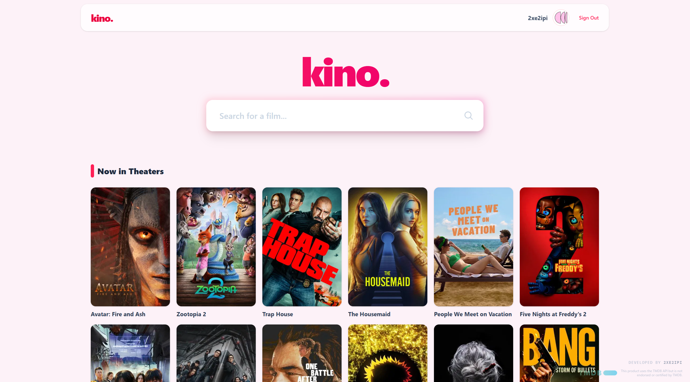
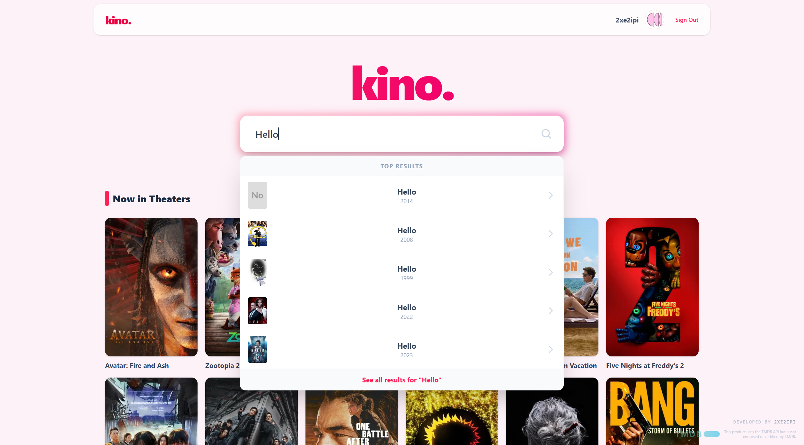
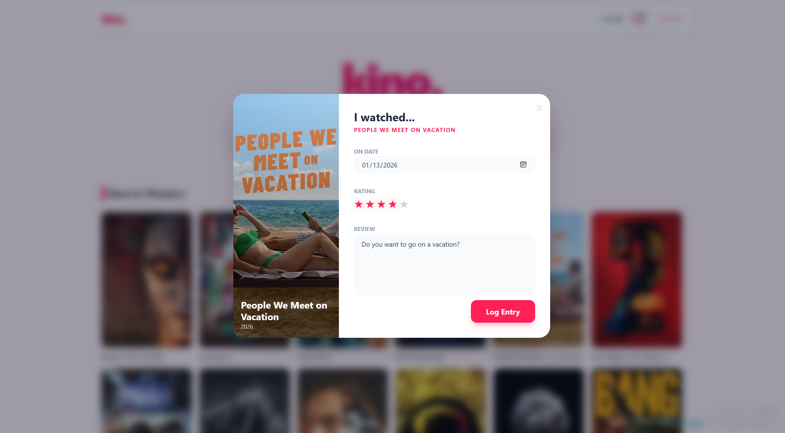
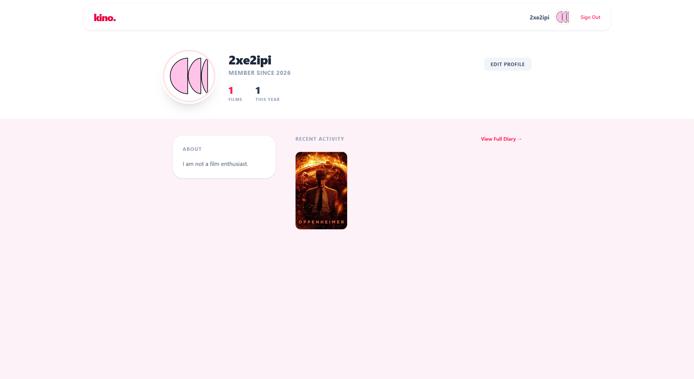

# 🍿 Kino.


> *"Cinema is a mirror of reality, often distorted."*

**Kino** is a social film diary designed for cinephiles. It allows you to track, rate, and review every film you watch. Yea, like Letterboxd. So unique.

Built with a focus on **Clean Architecture**, it leverages the raw performance of .NET on the backend and the instant reactivity of modern React.

---

## 📸 Feature Showcase

### 1. Home
The landing page. See what is currently in theaters and get quick access to your recent activity.


### 2. Search
Instant, real-time search powered by TMDB. Find any movie in milliseconds.


### 3. Log a Film
The core action. Rate, review, and save your thoughts in seconds.


### 4. Diary
A visual timeline of your cinematic history. Your past watches, organized.


### 5. Profile
Your identity. Track your yearly stats, customize your avatar, and manage your bio.


---

## 🛠️ Tech Stack

### **Backend (The Engine)**
* **Framework:** ASP.NET Core Web API
* **Architecture:** RESTful API with Clean Architecture
* **Database:** PostgreSQL (EF Core Code-First)
* **Auth:** Microsoft Identity + JWT Bearer

### **Frontend (The Interface)**
* **Framework:** React 18 (Vite)
* **Styling:** TailwindCSS (Glassmorphism Design System)
* **State:** Context API
* **Network:** Axios with Global Interceptors

---

## 🚀 Getting Started

### Prerequisites
* Node.js (v18+)
* .NET SDK
* PostgreSQL Database
* TMDB API Key

### 1. Clone the Repository
```bash
git clone https://github.com/drex/kino.git
cd kino
```

### 2. Backend Setup
Navigate to the server directory and set up your environment.

```bash
cd Kino.Server

# Setup secrets (.env or appsettings.json)
# DATABASE_URL="Host=...;Database=...;"
# TMDB_API_KEY="..."
# JWT_KEY="..."

dotnet restore
dotnet ef database update
dotnet watch run
```
*The API will launch at `http://localhost:5002`*

### 3. Frontend Setup
Open a new terminal for the client.

```bash
cd kino-client

# Create .env file:
# VITE_API_URL=http://localhost:5002

npm install
npm run dev
```
*The UI will launch at `http://localhost:5173`*

---

## 📂 Project Structure

```text
kino/
├── 📂 Kino.Server/           # The brains (API & DB Logic)
│   ├── 📂 Controllers/       # Endpoints
│   ├── 📂 Services/          # External Integrations
│   └── 📄 Dockerfile         # Production Config
│
└── 📂 kino-client/           # The face (React UI)
    ├── 📂 src/
    │   ├── 📂 components/    # Reusable UI elements
    │   ├── 📂 pages/         # Core Views
    │   └── 📂 context/       # Auth State Management
    └── 📄 tailwind.config.js
```

---

## 🤝 Contributing

Contributions are welcome. If you have an idea to make Kino better, please fork the repo and create a pull request.

---

<p align="center">
  Built with ❤️ by <strong>Drex</strong>.
</p>